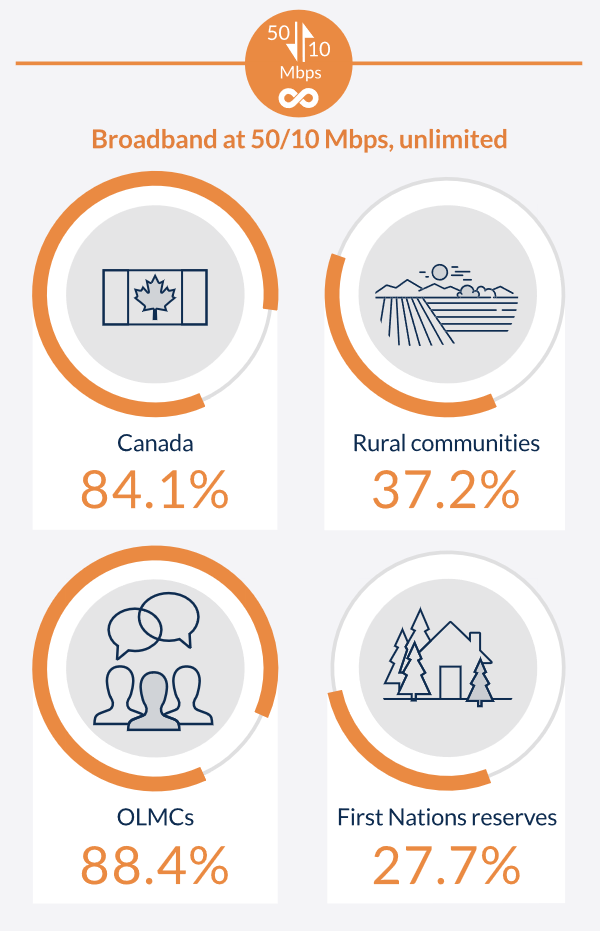
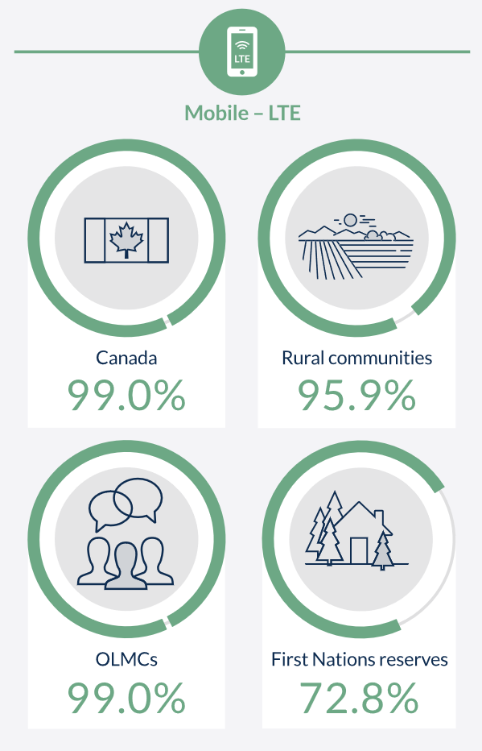

## Welcome to 420-520-DW Scalable Web Apps
This course will be taught by Jaya (section 01) and Maja (section 02) but we are team-teaching!

---

You'll see both of us during the semester, and both sections will be using the same material. Here's to a great semester in person!

---

## Before we start…

* write down some thoughts about what you want to get out of this course
  * what would you like to learn?
  * how would you like to learn it?

## Required tools

* Modern Browsers with dev tools
  * Google Chrome\, Mozilla Firefox
* Node.js
* git, git-bash
* VSCode with extensions:
  * LiveServer, eslint, npm, Express, MongoDb 
* Optional: Android phone
  * mobile phones are more resource constrained than laptops/desktops

::: notes

* [steps to set up remote debugging](https://developer.chrome.com/docs/devtools/remote-debugging/)
* if you don't have a phone\, simulate one\

The lab systems have been set up with VS Code as needed. You can install on your home system as we get to the various topics in the course. You will already have VSCode with LiveServer from 320 last fall.

:::

## Course motivation

What is Web Performance?

Why does it matter?

How can we measure it?

## Consequences of a slow website - I

* users will go to another site if a site is slow
* user expectations
  * 47% of consumers expect a web page to load in 2 seconds orless
  * 40% of people abandon a website that takes more than 3 seconds to load

  [source](https://neilpatel\.com/blog/loading\-time/)

## Consequences of a slow website - II

* search engine rankings
  * page speed used by Google for [mobile search rankings](https://developers.google.com/search/blog/2018/01/using-page-speed-in-mobile-search?hl=en)

---

"Through both internal studies and industry research, users show they prefer sites with a great page experience. In recent years, Search has added a variety of user experience criteria, such as how quickly pages load and mobile-friendliness, as factors for ranking results."

[source](https://developers.google.com/search/blog/2020/05/evaluating-page-experience)

## Consequences of a slow website - III

* disparity in internet access
  * unlimited broadband internet vs 2G networks with restricted bandwidth
* disparity in client devices
  * desktop/laptops vs older phones/limited battery life/low resolution screens
* mobile data is slower to load: additional handshake required to establish radio channel

[source](https://designingforperformance\.com/performance\-is\-ux/)

:::notes

__Latency__ is the amount of time it takes for a packet of data to get from one point to another\.

__Bandwidth__ is the maximum throughput of a communication path\, such as how much data can be transferred at once over fiber\-optic cables or your mobile carrier\.

[source](https://designingforperformance\.com/performance\-is\-ux/)

:::
---

{ width=400px }

---

{ width=400px }

[source](https://crtc\.gc\.ca/eng/publications/reports/PolicyMonitoring/2019/cmr1\.htm)

---

Certain populations (rural, lower income, First Nations) are disproportionately disadvantaged. Building website with high performance in mind is one way to be be inclusive.

## Goal

Fast and efficient web applications for _all_ users

## What is web performance

Web performance is the __objective measurement__ and __perceived__ user experience of a web site or application

[source](https://developer\.mozilla\.org/en\-US/docs/Learn/Performance/What\_is\_web\_performance)

## Improving perception

* why do we "feel" a site is slow or fast?
* some content comes quickly to keep the user occupied
  * feels like the wait is less
* content comes first\, then ads
  * reason why the user went to the site is fulfilled first

## Major areas for improvements

[source](https://developer\.mozilla\.org/en\-US/docs/Learn/Performance/What\_is\_web\_performance)

* reducing overall load time
  * compression of files
  * reducing number of files/http requests
  * caching and lazy loading techniques

## Major areas for improvements

* making the site usable as soon as possible
  * load critical components first \("above the fold"\)
  * defer less important features with lazy loading/preloading

## Major areas for improvements

* smoothness and interactivity

## How do you measure web performance?

web performance = how fast a web application is __perceived__ to be

what are the metrics that we can use to measure?

## Old way - Time to Page load

* Page load => start to load event
  * issue = load event can be manipulated to be fast
  * lot of critical data can be fetched after the load event
  * doesn't necessarily reflect users perception of the page being loaded

## Standard performance measurements - Core Web Vitals

* Largest Contentful Paint \(LCP\)

* First Input Delay \(FID\)

* CumulativeLayout Shift \(CLS\)

## Course organization

* course outline
  * policies, evaluation scheme

## Communication
  * Moodle
    * quizzes, assignment feedback
  * Lea
    * grades only
  * GitLab
    * material shared by teachers
    * students submit assignments
  * Slack
    * quick communication
  * Mio
    * communication that needs tracking
  * Office hours
    * on demand, Zoom or in-person

## Semi-flipped classroom
* weekly readings/video/small exercises assigned on Monday
  * goal= focus lecture time on most difficult concepts
* quizzes on Moodle - based on upcoming and previous material
  * The quizzes are more like homework, not in-class tests

## Plagiarism
The use of any other third party code / libraries is strictly forbidden, even if you have the code's author's permission to use it in (such as public-domain or free/open-source libraries) UNLESS your instructor gives you permission

## Academic integrity
* be reasonable
  * help classmates debug / explain / get a tutor
  * ask your teacher for help (they are very available on Slack)
  * ask your teacher what you are allowed to do (in case of doubt)

## Academic Integrity
* not considered as reasonable
  * comparing your code with a classmates code
  * looking at classmates working code
  * giving your code (even partial) to a classmate
  * submitting code written by someone lese or found online
  * working closely with a non-team member on an assignment

## When in doubt, don't do it! Ask your instructor!

## Week 1 tasks
* Watch this video:
  * [How Browsers Work (Overview)](https://youtu.be/uE3UPEK26U0?t=36)

* Read the following:
  * [Why Web Performance Matters](https://developer.mozilla.org/en-US/docs/Learn/Performance/why_web_performance)
  * [What is Web Performance](https://developer.mozilla.org/en-US/docs/Learn/Performance/What_is_web_performance)
  * [How Browsers Work](https://developer.mozilla.org/en-US/docs/Web/Performance/How_browsers_work)
   * [Web API Review: Document Lifecycle](https://javascript.info/onload-ondomcontentloaded)
     * Understand the difference between `window.load` and `document.DOMContentLoaded`

## Scared?
You don't have to understand or memorize all the details here, just the big ideas.

Remember, the goal is for your instructors to focus on the trickier material.
