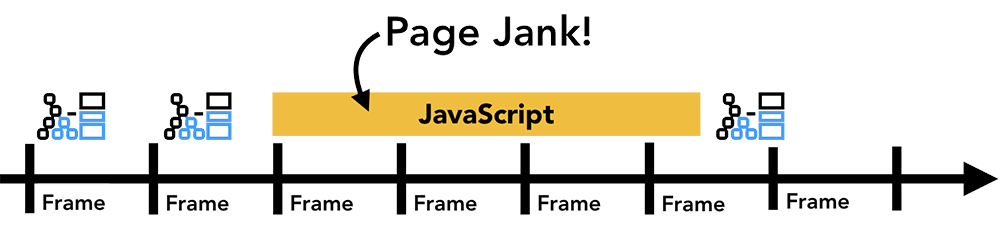
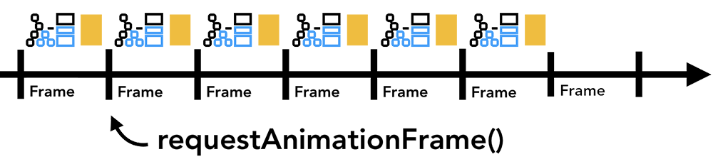

<style>
  ol li {
    list-style-type: lower-alpha
  } 
</style>

## Synchronous coding

Attributes:

- code that runs sequentially, in order as functions are invoked
- functions run to completion
- thus function calls are blocking
- main control structure = call stack

## When is blocking not desirable?

- waiting for user input
  - should be able to perform background tasks
- reading a file
  - opening the file can take time
- animation
  - do other things while waiting to draw the next frame
- communication with a server
  - Fetch API, XHR

## Message queue

- the message queue is the main control structure that deals with events
- the message queue contains all the messages waiting to be processed
- each message has the event and the associated function that will be called - i.e, a callback function

## Examples of events and messages

- user clicks -> event
  - if an event listener attached -> a message is added to the queue with the event listener

- user clicks ->
  - if no event listener attached -> no message added to the queue and the event is lost

- timer expires -> event
  - the setTimeout callback is added to the message queue

## Call stack and message queue


## Review - Timeout

```js
setTimeout( ()  =>  alert('Hello!') , 2000);
alert('bye!');
```
What is the result? Why?

What is in the call stack and how does it change?
What is in the message queue?

## When will the callback be invoked?

```js
setTimeout( ()  =>  alert('Hello!') , 0);
```
1. immediately
2. never
3. when it is first in the message queue 
4. when the call stack is empty and it is first in the message queue
5. I don't know

---

Answer is **d**.

A message in the queue is processed in order, so the timeout callback has to be at the front of the queue. 

But the callback invoked and added to the call stack only when there is nothing else running - so the call stack must be empty.

## Animations with setInterval

`setInterval` is like `setTimeout`, except that a message is repeatedly added to the message queue every time the interval expires, until `clearInterval` is invoked.

## Frames per seconds and animation

- Most screens have a refresh rate of 60 FPS
- animation using `setInterval` needs the interval to be about 16.7 milliseconds (1000/60)

---

```js
function draw() {
  //drawing code
}
setInterval(draw, 17);
```
What will happen if your page is very busy?

1. the animation might look "janky" since some frames are not drawn in time
2. setInterval gets higher priority since it has to run in 16 msec, so the animation will be smooth
3. clearInterval will be called by the page
4. the page will get a 500 Server Error
5. I don't know

---

The answer is **a**. 

Any animation that is not being drawn at 60 FPS risks looking like it is stuttering or skipping - basically janky! 



---

There is no VIP treatment in the message queue to get to the front, and the system doesn't treat the setInterval message differently that any other message. 

Reaction to user actions may be noticeably delayed when the browser page is too busy (since the message queue is not being emptied), but this is all happening on the browser. The server is unaware of any issues.

::: notes

Image source: [Inside look at modern browser](https://developers.google.com/web/updates/2018/09/inside-browser-part3)

:::

## requestAnimationFrame

`requestAnimationFrame` is a bit like `setTimeout`. It specifies the callback that is called once *before* the browser paints, and as such it does not take a time interval argument, and is only scheduled once.

---

The paint happens at the device's display frame rate.



::: notes

Here is an [example](https://developer.mozilla.org/en-US/docs/Learn/JavaScript/Client-side_web_APIs/Drawing_graphics#a_simple_drawing_application) of `requestAnimationFrame` in action!

Note: ⚠ Blindly replacing `setTimeout` and `setInterval` with `requestAnimationFrame`
won't make your code more performant. You still have to be smart about what code
you schedule with `requestAnimationFrame`: for example querying for size and 
position information in `requestAnimationFrame()` has a high probability of
causing a synchronous reflow. More about this later.

:::
---

What will this code do? Will it emulate `setInterval` by drawing every time the display is painted?

```js
while (true){
  requestAnimationFrame(draw);
}
```

---
How about this:

```js
function draw() {
   // Drawing code goes here
   requestAnimationFrame(draw);
}
draw();
```

Notice that the requestAnimationFrame is called recursively in this example, so that it keeps being called before every paint.


