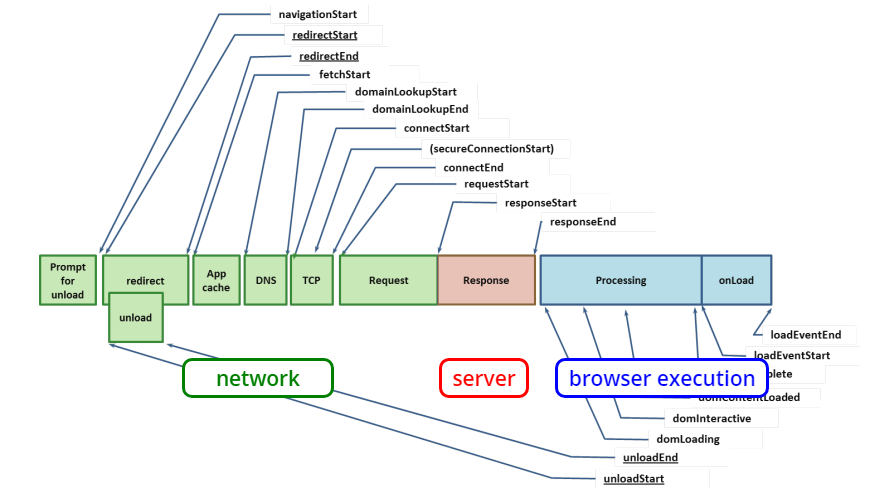

<style>
  ol li {
    list-style-type: lower-alpha
  }
  .present p, .present li {
    text-align: left;
  }
</style>

## The Critical Rendering Path


## Optimizing the CRP

To deliver the fastest possible time to first render, we need to minimize variables:

1. The time to connect and download resources
2. The number of critical resources {a resource that can block the initial rendering of the page}
3. The critical path length {dependancies between resources}
4. The number of critical bytes {number and size of critical files}


[source](https://developers.google.com/web/fundamentals/performance/critical-rendering-path/optimizing-critical-rendering-path)

## Measuring performance

The [Performance API](https://developer.mozilla.org/en-US/docs/Learn/Performance/Measuring_performance) enables developers to measure client-side web performance. The Navigation API is part of this family, and it allows you to measure things like the time for the browser to unload the previous page, how long domain lookups take, total time executing the windows onload event handler, etc... 

We will use the Performance API in our final project!

---

Navigation API's page life cycle:

[source](https://www.igvita.com/slides/2012/web-performance-for-the-curious/#19)

## 1. Optimize the time to connect and download resources

## Web server optimizations

* scale hosting / dynamic cloud
* bandwidth
* __reduce/optimize network requests__
* __reduce file size__

---

### HTTP/2 Multiplexing

* HTTP/1.1: synchronous loading 1 by 1, inefficient
  * Browsers cheat by opening 6 connections
  * Head-of-line blocking by HTML file

* HTTP/2: simultaneous download
  * Most servers support it
  * Modern browsers support it
  * __But only active with https connection__

---

### Caching to reduce requests

* caching can be done at the server, Content Delivery Network (__CDN__), or browser
  * server caching for server-side rendered sites (not in this course)
  * Use a CDN to cache files in multiple servers
    * static file will be served by the server closest to the user
  * browser: keep files until invalidated

---

* for browser caching:
  * server needs to set http response headers (`cache-control`, `expires`, `etag`) for caching responses

---

HTTP/2 multiplexing means it's best to have many __small__ JS modules and
CSS files

* updates to the files don't require re-downloading all other cached files.

## Connection 

Setting up the connection includes performing a DNS Lookup, TCP Handshake, and TLS negotiation

---

### Preloading assets

* you can anticipate connections that are needed and preconnect or preload earlier

`<link rel='preconnect' href='https://site'>`

* starts [pre-connecting](https://developer.mozilla.org/en-US/docs/Web/HTML/Link_types/preconnect) to a third-party site earlier, even if the actual request for a file from that site is later in the document

---

`<link rel='preload' href='main.js' as='script'>`

* [preloads](https://developer.mozilla.org/en-US/docs/Web/HTML/Link_types/preload) the file earlier and stores in browser cache
* causes priority loading and storage in the cache (i.e. the file jumps the normal loading queue)
* use for resources that are needed soon
* can be used for any resource as specificed by the `as` attribute
* when the file is needed, use the usual `<link>`, ``... tags and the file will be read from the browser cache
* you can also preload `fetch` resources

---

`<link rel='prefetch' href='image.jpg'>`

* lets the browser know that the resource will be needed in the future, so the browser can fetch and load in cache as a low priority 
* since it is a  _low priority_ load, the browser may abandon it if there's not enough bandwidth

---

When in doubt, don't use `preload` or `prefetch` and allow the browser to decide
what to load when.

---

### Server Push

Allows the server to push assets to client before they are requested.

---

Steps without server push:

1. Request HTML doc
2. Receive and parse HTML doc
3. if there's a CSS file linked in HTML, request it
4. Receive CSS
5. Same back and forth for JS and other assets, etc

---

With server push, you can configure your server to send additional assets
as soon as it gets a request for one particular asset. Example:

1. Request index.html
2. Receive index.html, style.css, main.js right way, so no additional requests needed from browser
3. By the time browser parses HTML and discovers it needs style.css, it has it in its cache already

---

Server push is out of scope for this course 😅

## 2- Reduce the number of critical resources

A critical resource is render blocking; eliminate as many as you can

---

### Eliminate render-blocking JavaScript

* Use `async` or `defer` attributes in the `<script>` tag so that the JS file doesn't block DOM construction
  * Use the `defer` attribute for any script that relies on the DOM. 
    * The browser won't wait for CSSOM construction before executing the script
  * Use the `async` attribute for any script where the order of execution doesn't matter, and does not need the DOM
    * The browser won't wait for DOM construction before executing the script

---

### Optimize CSS use

* reduce the amount of critical CSS to as little as possible
* weigh putting the critical CSS resources in the html head section in a `<style>` tag
  * Internal styles are loaded before body so they can be parsed right away

**vs**

* critical styles in a separate file that is downloaded once and cached by the browser for subsequent visits to the site

---

* avoid CSS imports `@import` since the browser can download the imported stylesheet only once it starts parsing the first CSS file

---

### Defer CSS

* Use JavaScript to defer the parsing of non-critical CSS files only when the 
page is fully loaded.

---

```html 
<link rel="preload" href="uncritical.css" as="style" 
  onload="this.onload=null; 
          this.rel='stylesheet'"
>
```

* The "preload" delays the parsing to avoid render blocking. 

---

Demo: [Defer non-critical CSS](https://web.dev/defer-non-critical-css/)

---

### Images

Images impact the LCP metric and user experience.

* resize and optimize images
  * [sharp-cli](https://www.npmjs.com/package/sharp-cli)
* use next-generation formats (WebP, svg)

---

### Reduce file size

* minify: removes comments, whitespace
  * [minifier](https://www.npmjs.com/package/minifier)
  * [html-minify](https://www.npmjs.com/package/html-minify)
  * __note__ It is important to keep your original unminified files for development.
* compress all files at the server
  * enable gzip or Brotli compression on the server

---

Two options to ensure that you deploy minified files

1. Use a Continuous Integration/Continuous Delivery (CI/CD) pipeline in GitLab to minify and replace files __before__ deploying
2. alternatively, setup a pipeline to minify files, and save them with a different file extension, e.g. `min.js`


