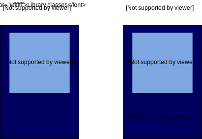

<style>
  ol li {
    list-style-type: lower-alpha
  }
  .present p, .present li {
    text-align: left;
  }
</style>

## Introduction to node.js

* Node.js is a platform built on the V8 engine (Chrome's JavaScript run-time environment)
  * reliable and supported
* executes JavaScript outside the browser
* large ecosystem of packages through npm
* It is best known for building fast and scalable network applications. 
* But we can also us it for CLI-type applications

## Be careful!

Node.js is **NOT** client-side JavaScript

## Some things are similar

* both the browser and Node.js use JavaScript
* the language is the same: functional
* the runtime envornment is similar
  * single threaded, event-driven

## But some things are very different

* JS running on the browser uses the Web API
  * gives access to the DOM and many other objects provided by the browser
* node.js provides an ecosystem of package that are **not** available to the browser

---

* node.js developer can control the JS version (since they control the server)
* client-side developers have to consider many different browser engines and versions

---

* node.js uses both CJS and ESM modules
* browsers are standardizing on ESM

## What is V8?


---

* Each browser has their own JavaScript engine
  * V8 for Chromium
  * SpiderMonkey for Firefox
* the engine provides the runtime environment, implements ECMAScript standard

---

* Aside: browser layout engines provide the DOM and other Web APIs (e.g., Blink for Chrome, Gecko for Firefox)
  * these are **not** available in node.js

---

* V8 is also behind Electron, the application framework used by VSCode
* V8 is similar-ish to the JVM: just-in-time compiles JavaScript to byte code which is then compiled to native code, then executed



[source](https://www.educative.io/blog/what-is-nodejs)

## Be careful! 

Doesn't the web server have to serve JS files? 

---

Yes, but the server doesn't run files that are being sent to the browser!

---

```
        request a page
Client -------------------> Node.js server
       <-------------------
       response:
       <html>
        <head>
        <script src="index.js">
```

---

```
        request index.js
Client -------------------> Node.js server
       <-------------------
       response:
       "use strict";...
```

## Files running on Node.js are NOT the files being served

We will soon see what a simple hardcoded Node.js web server looks like!

## Uses of Node.js

* command line scripts
* Web server-side programming
  * can replace the web server (Apache or nginx)
  * can be used as a simple web application server
* Express is a web application framework

## Demo - REPL

1. make sure node is installed: `node --version`

2. using the node REPL (read-evaluate-print loop)

```
node
1+1
"jaya".toUpperCase()
[1,2,3].forEach(
 console.log)
.exit
```

* nb: a REPL is a console window that takes single expression as user input and returns the result back to the console after execution. [source](https://nodejs.dev/learn/how-to-use-the-nodejs-repl)

## Running a script

script.js
```js
"use strict";
console.log("Hello world!");
```

`node script.js`

---

What happens if you open script.js though LiveServer (VSCode's built-in web server)?

Why?

---

## Creating a node project with dependancies

```bash
cd firstProject
npm init
```
* this will create the `package.json` file
* use `npm install` to install local dependencies and update `package.json`
* demo with the exercise!

## CLI application - skeleton

```js
//if it is not a module
"use strict";

//
// App specific module imports here.
//

//
// Argument checking here if relevant.
// process.argv is an array conatining all argumaent passed in

//
// Implement the code for the app here.
//

```
## CLI arguments

[Documentation](https://nodejs.org/en/knowledge/command-line/how-to-parse-command-line-arguments/)

* see `example/06_node_cli/example.js`
* launch your node.js app as follows:
`node example.js one two three four`
* within `example.js`, the `process.argv` will contain:
```js
[ 'node',
  '/path/to/file/example.js',
  'one',
  'two',
  'three',
  'four' ]
```

---

* the first two elements of `process.argv` are always present: `node` and the path to the script, even if the script takes no arguments
* you can ignore them: `let myArgs = process.argv.slice(2);`
* myArgs will contain:
```js
[  'one',
  'two',
  'three',
  'four',
  'five' ]
```

## Argument data validation

```js
let myArgs = process.argv.slice(2);
//looking at first argument
switch (myArgs[0]) {
case 'one':
    console.log(myArgs[1]);
    break; //break required to prevent fall-through
case 'two':
    console.log(myArgs[2]);
    break;
default:
    console.error('Sorry, invalid argument.');
}
```
## Using yargs

With more complicated arguments, like flags which can be in any order, use `yargs` package

* looks at `rectangle.cjs`
* First `npm init`
* Then install: `npm install yargs`
* note: I added a `.gitignore` to the folder
```js
const yargs = require('yargs'); //CJS
const argv = yargs.argv;
// in one line: const {argv} = require('yargs');
console.log(argv)
```

## Example

`node .\rectangle.cjs --width 10 --height 11.2`

* `yargs.argv` will contain:
`{ _: [], width: 10, height: 11.2, '$0': 'rectangle.js' }`
* `argv.$0` is the name of the script
* `argv._` is an array with elements not following a flag
* the flags become properties of the `argv` object
* if there is an error, use the appropriate error code `system.exit(9)`
[Process exit codes](https://nodejs.org/api/process.html#process_exit_codes)

## the fs module

[Documentation](https://nodejs.org/api/fs.html)

* part of node.js core, so nothing to `npm install`
* two API's available:
  * older, callback-based
  * newer, Promise-based
  * guess which one we will be using 😉

`const fs = require("fs/promises");`

---

* note that the doc allows you to toggle between ESM and CJS
* if you use ESM, give your file the extension `.mjs`
* if you use CJS, give your file the extension `.cjs`

## Using fs with `async await`

```js
async function read(useData) {
  try {
    let data = await fs.readFile('./datafile.csv');
    useData(data);
  } catch (err) {
    console.error(err.message);
  }
}

read(data => {
  console.log(data);
})
```

## Using fs with `then`

```js
function read(useData) {
    fs.readFile('./datafile.csv')
    .then(useData)
    .catch(err => {
      console.error(err.message);
  });
}

read(data => {
  console.log(data);
})
```

## Exercise - Write a CLI JS script

* The script takes the full path to a JSON file as the argument
* [check if the path exists](https://nodejs.org/api/fs.html#fs_fspromises_access_path_mode)
* [make sure it is a file](https://nodejs.org/api/fs.html#fs_fspromises_stat_path_options) with `stats.isFile()` check
* open the file
* parse the JSON
* write the names of all the planets larger than earth to the console
